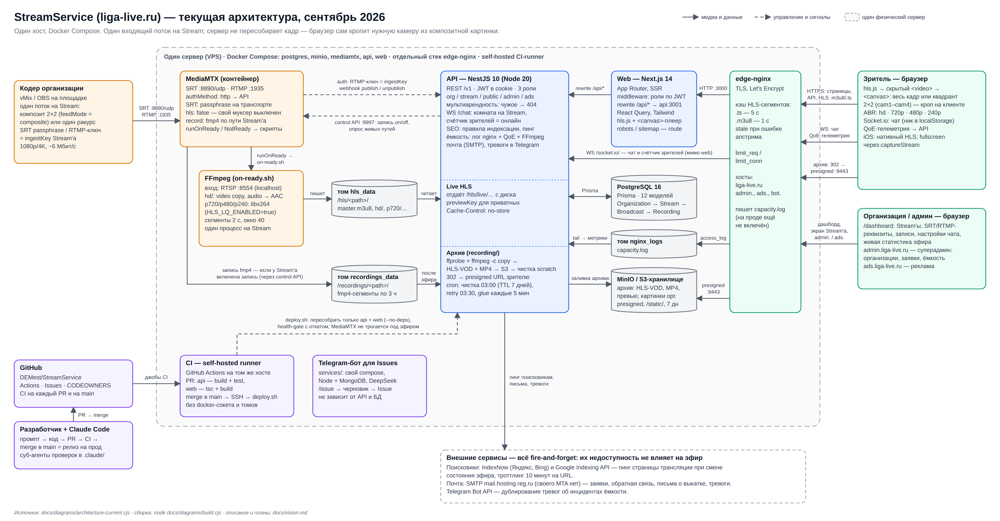
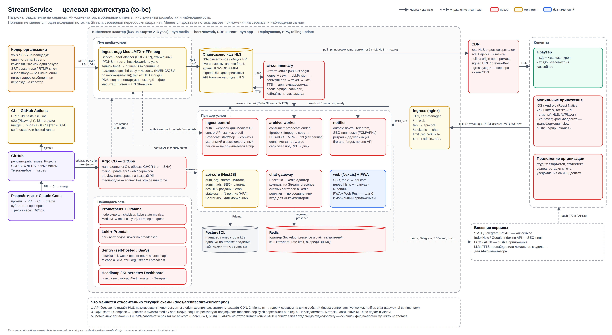

# Vision: StreamService (Liga Live)

Документ отвечает на два вопроса: **что представляет собой продукт сейчас** и
**куда он развивается**. Он же — точка входа для тех, кто видит проект впервые:
преподавателя, нового участника, агента, которому ставят задачу.

Две диаграммы рядом с ним — часть документа, а не иллюстрации к нему:

- [`architecture-current.png`](architecture-current.png) — текущая архитектура
  (as-is), сентябрь 2026;
- [`architecture-target.png`](architecture-target.png) — целевая архитектура
  (to-be), к которой ведут разделы 3–4. Цвет коробки на ней говорит, что с
  компонентом происходит: красная — новое, жёлтая — меняется, остальные —
  без изменений.

Исходники диаграмм и сборка — в [`diagrams/`](diagrams/) (раздел 7).
Прочие документы в `docs/` (`architecture.md`, `roadmap.md`, корневой
`plan.md`) описывают более ранние этапы и оставлены как история решений.

---

## 1. Продукт

**Liga Live ([liga-live.ru](https://liga-live.ru))** — платформа
видеотрансляций спортивных турниров. Стартовая ниша — борьба, но ни одна
сущность системы не привязана к виду спорта.

Кто и зачем пользуется:

| Роль | Что получает |
|---|---|
| Спортивная организация (лига, федерация, клуб) | Подключает свой видеомикшер (vMix/OBS) по SRT или RTMP, получает страницу трансляции, чат, архив эфиров, живую статистику и реквизиты для кодера в личном кабинете |
| Зритель | Смотрит эфир в браузере без регистрации, сам переключает ракурсы камер, общается в чате, пересматривает запись и скачивает MP4 |
| Оператор платформы (суперадмин) | Заводит организации, разбирает заявки и обращения, следит за ёмкостью сервера, управляет рекламными местами |

Ценность для организации — «один поток в сервер, всё остальное сделано»: не
нужно ни своей инфраструктуры, ни четырёх отдельных стримов на четыре мата.

**Ключевое решение, на котором стоит всё остальное:** организация отправляет
**один** поток на Stream — либо композитную картинку (например, раскладка
2×2 с четырёх камер, собранная в vMix), либо один ракурс. Сервер этот поток
**никогда не пересобирает и не разрезает**. Браузер декодирует единственный
HLS-поток и рисует на `<canvas>` либо весь кадр, либо нужный квадрант. Это
даёт N зрителям N декодирований одного потока вместо N раздельных стримов с
сервера — и на порядок более дешёвую инфраструктуру. Транскодирование есть
только в лесенке качеств для доставки, и только для копий, никогда для
основного фида.

Что уже реализовано и работает в продакшне: приём SRT/RTMP, лесенка HLS
(оригинал + 720p/480p/240p), мультиарендность (организация → несколько
Stream'ов → эфиры), приватные трансляции по ссылке, запись эфиров в
S3-совместимый архив с MP4 для скачивания, живой чат, кабинет организации со
статистикой эфира, админка с заявками, обратной связью и экраном ёмкости,
рекламные места, SEO (динамические sitemap/robots, JSON-LD, пинг поисковиков),
поиск по сайту, правовые документы с версионированием согласия, CI/CD с
автодеплоем под живым эфиром.

---

## 2. Текущее решение (as-is)

### 2.1 Из чего состоит

Весь стек живёт на **одном сервере (VPS)** в Docker Compose плюс отдельный
стек `edge-nginx` на том же хосте. Наружу открыт только ингест (SRT/RTMP) и
то, что явно проксирует nginx.

| Компонент | Технологии | За что отвечает |
|---|---|---|
| `mediamtx` | MediaMTX + FFmpeg в одном контейнере | Приём SRT `:8890/udp` и RTMP `:1935`; аутентификация публикации через API; запись сырых fmp4-сегментов; запуск FFmpeg, который пишет live HLS |
| `api` | NestJS 10, Prisma 6, Socket.io, cron | REST `/v1`, WebSocket-чат, **отдача live HLS с диска**, вебхуки MediaMTX, жизненный цикл эфира и записи, пост-обработка архива, SEO, метрики ёмкости, почта и тревоги |
| `web` | Next.js 14 (App Router), hls.js, React Query, Tailwind | Публичные страницы, кабинет организации, админка; плеер на `<canvas>`; прокси `/api/*` в API; проверка ролей в middleware |
| `postgres` | PostgreSQL 16 | 12 моделей Prisma, 21 миграция (на сентябрь 2026) |
| `minio` | MinIO (S3-совместимое) | Архив записей (HLS-VOD, MP4, превью), картинки организаций; presigned-ссылки |
| `edge-nginx` | nginx, Let's Encrypt | TLS, кэш HLS-сегментов (`.ts` 5 с, `.m3u8` 1 с, stale при ошибке апстрима), лимиты, разнесение хостов `liga-live.ru` / `admin.` / `ads.` / `bot.` |
| CI-runner | GitHub Actions, self-hosted | Сборка и тесты на каждый PR; выкатка на прод по merge в `main` |
| Telegram-бот | Node + MongoDB + DeepSeek, отдельный compose | `/issue <текст>` в группе → черновик от модели → GitHub Issue; не зависит от API и БД платформы |

Объём кода на сентябрь 2026: около 30 тыс. строк TypeScript в `apps/api` и
`apps/web`, 20 модулей API, 40 файлов тестов (Jest, только backend).

### 2.2 Путь потока

1. Кодер публикует поток по SRT (passphrase проверяет сам транспорт) или RTMP
   (ключ сверяется с `ingestKey` Stream'а через `POST /v1/internal/mediamtx/auth`).
2. MediaMTX по `runOnReady` запускает `on-ready.sh`: тот шлёт вебхук
   `publish` в API и поднимает **один FFmpeg на Stream**. FFmpeg тянет поток
   по RTSP с `localhost:8554` и пишет в общий том `/hls/<path>`: `hd/` — копия
   видео без транскода (аудио перекодируется в AAC), `p720/p480/p240` — libx264.
   Сегменты по 2 с, окно плейлиста 40 сегментов. На 4K-входе лесенка стоит
   ~7 ядер; `HLS_LQ_ENABLED=false` оставляет только копию (~1 ядро).
3. API на вебхук создаёт `Broadcast` (и включает запись через control API
   MediaMTX, если у Stream'а `recordingMode=auto`). Параллельные вебхуки по
   одному Stream'у сериализуются мьютексом — иначе частые реконнекты кодера
   плодили бы двойные эфиры.
4. Зритель открывает `/watch/<org>/<stream>`. Плейлисты и сегменты идут по
   цепочке браузер → nginx (кэш) → web (rewrite `/api/*`) → **API читает файлы
   с диска**, проверяя `isPublic`/`previewKey`. Чат — WebSocket `/socket.io/`
   напрямую в API, мимо web.
5. hls.js декодирует поток в скрытый `<video>`; `<canvas>` рисует весь кадр
   или квадрант. Плеер отправляет QoE-телеметрию (подвисания, время загрузки
   фрагмента, текущая ступень лесенки) — из неё складывается экран ёмкости.
6. На `unpublish` эфир закрывается (или ставится на паузу в ручном режиме
   записи), `on-not-ready.sh` удаляет `/hls/<path>`, API пингует поисковики.

### 2.3 Модель данных и мультиарендность

`Organization → Stream → Broadcast → Recording`. Центральная сущность —
**Stream**, а не организация: именно у него ingest-ключ, приватность, режим
подачи (`single`/`composite`), режим записи и live-состояние. Организация —
арендатор с несколькими Stream'ами и общими настройками чата. Все `/v1/org/*`
фильтруются по `orgId`; чужой Stream отдаётся как 404, чтобы не раскрывать
существование. Роли — `superadmin`, `org_admin`, `ad_manager`; JWT в HttpOnly
cookie (access 1 ч, refresh 90 дней), cookie host-only — это и позволяет
держать две сессии на разных поддоменах.

### 2.4 Архив

После эфира API **без перекодирования** собирает из fmp4-сегментов HLS-VOD
плейлист (`ffprobe` для длительностей) и один `download.mp4` (`ffmpeg -c copy`),
делает превью, заливает всё в S3 и только после успешной заливки помечает
запись готовой. Тяжёлые байты зрителю уходят **302-редиректом на
presigned-ссылку** — мимо канала API. Срок хранения 7 дней; кроны: чистка в
03:00, повтор неудачных заливок в 03:30, закрытие «зависших» ручных эфиров
каждые 5 минут.

### 2.5 Как ведётся разработка и эксплуатация

- **CI/CD.** На каждый PR и на `main`: сборка и тесты API, типы и сборка web.
  Merge в `main` = релиз: раннер по SSH запускает `infra/deploy/deploy.sh`,
  который пересобирает **только `api` и `web`** (`--no-deps`), ждёт health-gate
  и откатывается при неудаче. MediaMTX не трогается — эфиры, лесенка и запись
  переживают деплой; зритель видит лишь ~5 с паузы отдачи HLS, которую
  сглаживают кэш nginx и окно плейлиста. Если diff задел `infra/mediamtx/*`
  или `docker-compose.yml`, а эфир идёт, деплой прерывается, не тронув
  контейнеры; повторить его — следующим пушем без эфира или с явным `force`.
- **Агентная разработка.** Задача ставится одним промптом; агент (Claude Code)
  следует зафиксированным в `CLAUDE.md` решениям, прогоняет изменения через
  цепочку проверяющих суб-агентов (`task-completion-validator`,
  `qa-browser-tester`, `claude-md-compliance`, `code-quality-pragmatist`,
  `live-safety-auditor` — последний решает, можно ли выкатывать под эфиром),
  открывает PR, дожидается зелёного CI и мержит сам.
- **Обратная связь и инциденты.** Заявки с лендинга и обращения зрителей (с
  техническим контекстом: URL, стрим, user-agent) копятся в админке и уходят
  письмом. Экран `/admin/capacity` считает заполнение канала и потолок по
  зрителям, открывает инциденты (`uplink`/`encode`/`errors`/`stalls`/`offline`)
  и дублирует тревоги в почту и Telegram. Telegram-бот превращает сообщения
  из рабочей группы в GitHub Issues.

### 2.6 Границы текущего решения

Это то, ради чего написан раздел 3. Всё ниже — не дефекты, а осознанные
рамки MVP, которые продукт перерос или скоро перерастёт.

1. **Потолок по зрителям задан каналом одного сервера.** Экран ёмкости считает
   его как `UPLINK_MBPS × (1 − CAPACITY_HEADROOM) / средний вес зрителя`:
   при канале 750 Мбит/с и запасе 20 % это ~600 Мбит/с на отдачу — около
   **90 зрителей, если все смотрят оригинал (6,5 Мбит/с), и ~250 при обычном
   миксе качеств**. Ни CDN, ни второго сервера отдачи нет.
2. **API отдаёт live HLS сам.** Каждый сегмент проходит через Node-процесс;
   рестарт API ставит отдачу на паузу; масштабировать API горизонтально
   нельзя, пока сегменты лежат на локальном томе.
3. **Монолит с разными профилями нагрузки.** В одном процессе — HTTP с
   низкой задержкой, раздача файлов на сотни мегабит, тысячи WebSocket-
   соединений чата, CPU-тяжёлая склейка архива и кроны. Счётчик зрителей и
   мьютексы живут в памяти процесса — второй экземпляр API их не увидит.
4. **Транскод лесенки — ~7 ядер на один 4K-эфир.** Несколько параллельных
   эфиров упираются в CPU одного хоста.
5. **Одна точка отказа на всё:** хост, диск, PostgreSQL, MediaMTX. Рестарт
   MediaMTX рвёт приём у всех стримеров сразу — поэтому деплой и обходит его.
6. **Наблюдаемость — только продуктовая.** Есть экран ёмкости и QoE, но нет
   трекинга ошибок с группировкой и стек-трейсами, нет метрик по контейнерам и
   хосту, нет централизованных логов. Разметка лога nginx для метрик отдачи
   на проде ещё не подключена (известный пробел, см. `infra/deploy/DEPLOY.md`).
7. **Тесты только у backend**, интерфейс проверяется браузерным агентом
   вручную; нет стендов на PR; один раннер гонит джобы последовательно.
8. **Мобильные зрители — через браузер.** Есть web-манифест, но нет service
   worker, push-уведомлений и нативных приложений; на iOS полноэкранный режим
   собирается через `captureStream`.
9. Задержка — обычный HLS (секунды), LL-HLS не включён.

---

## 3. Куда развиваем (to-be)

**Что не меняется.** Один поток на Stream и компоновка на клиенте — это не
ограничение MVP, а экономическая основа продукта; целевая схема сохраняет её
целиком. Не меняется и способ работы: merge = релиз, агентная разработка с
проверяющими суб-агентами, правило «под эфиром медиа-часть не трогать».

**Что меняется** — пять направлений ниже плюс инфраструктурный переезд, который
их связывает.

### 3.1 Нагрузка: от ~250 зрителей на сервер к тысячам на трансляцию

Цель: **2 000 одновременных зрителей на эфир и 10 параллельных эфиров** без
деградации на первом шаге; **10 000+** — после подключения CDN. Нынешние ~250
— это потолок канала, а не приложения, поэтому порядок работ такой:

1. **Вынести отдачу HLS из API.** Пакетировщик (FFmpeg) пишет сегменты не в
   локальный том, а в origin-хранилище (S3-совместимое или общий PV); зрителям
   их раздаёт nginx/CDN напрямую. API остаётся выдавать доступ: для приватных
   трансляций `previewKey` превращается в **подписанный URL** с коротким сроком
   жизни, который проверяет edge. Это единственное изменение, которое одновременно
   снимает нагрузку с API, делает его stateless и открывает путь к CDN.
2. **CDN перед origin.** Сегменты и так кэшируются (nginx уже делает это по
   ключу `$uri|$arg_key`) — CDN просто выносит кэш к зрителю, а egress с
   сервера в сеть провайдера. Выбор провайдера — по цене исходящего трафика и
   наличию точек в регионах зрителей; для российской аудитории кандидаты —
   Yandex Cloud CDN, EdgeCenter, Selectel; для теста — Cloudflare.
3. **Чат без привязки к процессу.** Socket.io с Redis-адаптером, presence и
   счётчик зрителей в Redis — тогда экземпляров чата может быть сколько угодно.
4. **Медиа-узлы отдельно от приложения.** MediaMTX + FFmpeg на выделенных
   узлах; добавление узла = +N эфиров. Аппаратное кодирование (NVENC/QSV) для
   лесенки там, где 7 ядер на эфир становятся дорогими.
5. **LL-HLS** после того, как доставка вынесена: задержка с секунд до ~2 с.
6. **Нагрузочные тесты как часть процесса** (k6): сценарий «N зрителей тянут
   сегменты + M в чате», запускается по расписанию и перед крупными релизами;
   его результат заменяет расчётный потолок измеренным.

### 3.2 Разделение на сервисы: что резать, а что нет

Сегодня всё, что «работает сейчас», — это один процесс NestJS плюс контейнер
MediaMTX и независимый Telegram-бот. Резать по границам **разных профилей
нагрузки и разных требований к доступности**, а не по модулям ради модулей:

| Сервис | Что забирает из монолита | Почему отдельно |
|---|---|---|
| `ingest-control` | auth и вебхуки MediaMTX, control API (запись on/off), старт/стоп `Broadcast` | Маленький, но критичный: если он лежит, эфир не принимается. Должен быть доступен даже во время выкатки остального |
| `archive-worker` | пост-обработка записи, заливка в S3, кроны чистки/retry/glue | CPU и диск, пакетная работа, ретраи — это семантика очереди, а не HTTP-сервера; живёт на своём узле |
| `chat-gateway` | WebSocket-чат, presence, счётчик зрителей | Масштабируется по числу соединений, а не по RPS |
| `notifier` | почта, Telegram, SEO-пинг, push | Outbox с ретраями и дедупликацией; сейчас это fire-and-forget внутри API |
| `ai-commentary` | новое (раздел 3.3) | Свой цикл жизни и своя стоимость, отдельно от всего |
| `api-core` | остаётся: auth, организации, Stream'ы, каталог, админка, реклама, SEO-правила | Это одна связная предметная область; резать её на «org-service» и «stream-service» — лишние сетевые хопы и распределённые транзакции без выигрыша |

Связь между сервисами — **шина событий** (Redis Streams на старте, NATS при
росте): `broadcast.started`, `broadcast.ended`, `recording.ready`. Ядро и
клиенты продолжают ходить по REST. База на старте одна; владение таблицами
закрепляется за сервисами постепенно (archive-worker пишет только в
`Recording`, chat-gateway — только в `ChatMessage`), и лишь потом, если
понадобится, разъезжается физически.

Порядок — **strangler**: один сервис за раз, за теми же маршрутами nginx,
монолит продолжает работать. Первым выходит `archive-worker` (наибольший
выигрыш по устойчивости, наименьший риск), затем `chat-gateway`, затем
`ingest-control`. Каждый вынос сопровождается своей CI-джобой, health-check'ом и
контрактом (OpenAPI для REST, схема событий для шины).

Чего **не** делать: не заводить сервис на каждый модуль NestJS, не дублировать
источник истины (одна БД, один Prisma-schema до тех пор, пока владение
таблицами не закреплено), не вводить второй копии правил (индексации, ёмкости)
«для проверки».

### 3.3 AI-комментирование

Продуктовая идея: у каждой трансляции может быть **AI-комментатор** —
сначала текстом в чате и на странице, затем голосом отдельной аудиодорожкой,
а после эфира — автоматические саммари, хайлайты и главы для архива.

Механика, согласованная с главным принципом (основной фид никто не трогает):

1. Сервис `ai-commentary` по событию `broadcast.started` подписывается на
   **копию `p480`** из origin — этого достаточно для распознавания, и это
   не добавляет ни одного процесса к основному потоку.
2. Раз в несколько секунд берёт кадры и звук, извлекает события: табло
   (OCR), смена пары на мате, активные действия. Для мозаики 2×2 кадр режется
   на квадранты той же картой `QUAD`, что и в плеере, — только как вход для
   распознавания, зрителю это как видео не отдаётся; комментировать можно
   каждый мат отдельно.
3. Языковая модель (провайдер заменяем: DeepSeek уже используется в боте,
   подойдёт любой API с vision) пишет комментарий на основе событий и
   **контекста от организации** — участников, сетки, регламента, терминологии.
   Такой «AI context» на группу уже есть в Telegram-боте; здесь он появляется
   у Stream'а.
4. Текст уходит в комнату чата от системного пользователя через
   `chat-gateway`, события сохраняются как таймлайн эфира (главы архива).
5. Голос: TTS → отдельная аудиодорожка в master-плейлисте (`EXT-X-MEDIA`);
   меняется только master.m3u8, который пишет пакетировщик. Зритель включает
   дорожку в плеере; видео не перекодируется.

Ограничения, которые задают форму MVP: отставание комментария от live —
секунды (комментатор работает поверх HLS-задержки); стоимость — минуты
модели и TTS на час эфира, поэтому функция включается по Stream'у и
считается в статистике организации; модерация — комментарий проходит те же
фильтры, что и чат. MVP — текст и пост-обработка архива; голос — вторая
итерация. Побочный выигрыш — SEO: страница записи получает текст, который
поисковики индексируют.

### 3.4 Мобильные приложения

Зритель уже приходит с телефона; сейчас его обслуживает адаптивная вёрстка и
нативный HLS на iOS. Что именно даст приложение и в каком порядке:

0. **PWA как проверка спроса** — service worker, установка на экран, Web Push
   «эфир начался». Манифест уже есть; это самая дешёвая итерация и она же
   вскрывает, нужны ли push-уведомления как продукт.
1. **Приложение зрителя** (iOS/Android, React Native или Flutter): нативные
   плееры (AVPlayer / ExoPlayer) с HLS, кроп квадранта — трансформация
   video-view внутри клиппера, та же карта `QUAD`; чат через Socket.io;
   push-уведомления о начале эфира любимых организаций; фоновое аудио.
2. **Приложение организации**: живая статистика эфира, старт/стоп, ротация
   ключа, уведомления об инцидентах — то, что сейчас требует открыть ноутбук
   рядом с микшером.

Что нужно от backend: Bearer JWT в заголовке в дополнение к cookie, реестр
push-токенов, версия API для клиентов (`/v1` уже стабильна, но потребуется
политика совместимости). `feedMode` в watch-DTO уже есть; карта `QUAD` —
константа плеера, мобильный клиент держит свою копию, бэкенд её не отдаёт.
Приложение — это ещё один клиент того же `api-core`, отдельного «mobile
backend» не появляется.

### 3.5 Инструменты для ведения разработки

**CI** (есть, развивается). К сборке и тестам добавляются: линтер и форматер
в CI (сейчас не подключены), e2e-тесты интерфейса на Playwright (сейчас их
роль играет браузерный агент), проверка миграций (`prisma migrate diff`),
аудит зависимостей, образы с тегом = SHA коммита в GHCR, **стенд на каждый
PR** (namespace в кластере или compose-проект на тестовом хосте), второй
раннер для параллельных джоб, нагрузочный прогон k6 по расписанию. Деплой
переезжает из `deploy.sh` в GitOps (Argo CD): «что выкачено» читается из Git,
а не из `.deployed` на сервере.

**Поиск ошибок** — трекинг ошибок с группировкой, стек-трейсами и связью с
релизами, по образцу внутреннего инструмента поиска ошибок, как в Яндексе.
Кандидаты: **Sentry** (self-hosted или SaaS) или более лёгкий GlitchTip. Что
подключается: SDK в API (NestJS), в web (браузер и SSR) и в мобильных
приложениях; загрузка source maps в CI; `release = SHA`, `environment =
prod|stand`; теги `orgSlug`, `streamSlug`, `broadcastId`, `rendition`;
ошибки hls.js из плеера — рядом с QoE-событиями, чтобы «тормозит видео» из
обратной связи разбиралось по одному `broadcastId`; алерты в Telegram.
Обращения из `/admin/feedback` получают ссылку на события за то же время и с
того же user-agent.

**Интерфейс для наблюдения за подами и нодами.** Появляется вместе с
Kubernetes (раздел 3.6): **kube-prometheus-stack** (Prometheus, Grafana,
Alertmanager, node-exporter, kube-state-metrics, cAdvisor) для метрик узлов и
подов, **Loki + Promtail** для логов, **Headlamp / Kubernetes Dashboard** как
UI по подам, узлам и rollout'ам. MediaMTX отдаёт метрики сам (`metrics: yes`),
FFmpeg — через progress-файл, который уже читает статистика эфира. Экран
`/admin/capacity` остаётся **продуктовым** («сколько зрителей выдержим»),
инфраструктурный уровень («какой под ест CPU») живёт в Grafana. До переезда
на кластер тот же результат на текущем хосте даёт связка Portainer +
cAdvisor + node-exporter + Grafana — это первый шаг, он не ждёт Kubernetes.

### 3.6 Kubernetes: что в нём специфично для этого продукта

Переезд на кластер (k3s, 2–3 узла на старте) — не самоцель, а способ
получить горизонтальное масштабирование, rolling update и наблюдаемость из
коробки. Специфика проекта, которую нельзя потерять:

- **Ингест — UDP и стабильный адрес.** SRT ходит по UDP; медиа-поды живут в
  отдельном пуле с `hostNetwork` или за `Service` типа LoadBalancer с
  сохранением IP; адрес и порты ингеста в кабинете организации не меняются.
- **Правило живого эфира переезжает в PDB.** Сейчас `deploy.sh` не трогает
  MediaMTX, пока есть публикации. В кластере то же самое выражается
  `PodDisruptionBudget` и drain-хуком, который ждёт окончания эфиров либо
  явного force — иначе rolling update медиа-пода оборвёт приём у всех.
- **Сегменты — не в локальном томе.** HLS и записи пишутся в origin-хранилище,
  иначе ни CDN, ни второй под API невозможны.
- **Миграции БД** запускаются как Job до выкатки API, а не при старте
  контейнера: сейчас медленная миграция удлиняет паузу отдачи HLS.

---

## 4. Дорожная карта

Сроки — ориентир для планирования, не обязательство; этапы отсортированы так,
чтобы каждый следующий опирался на предыдущий, а наблюдаемость появилась
раньше масштабирования (нельзя оптимизировать то, что не измерено).

| Этап | Горизонт | Что делаем | Критерий готовности |
|---|---|---|---|
| **0. Измерить** | 1–2 мес. | Sentry для api/web; Prometheus + Grafana + cAdvisor + node-exporter на текущем хосте; включить разметку лога nginx на проде; метрики MediaMTX; базовый k6-сценарий | Ошибки видны с стек-трейсами и релизом; дашборд узла и контейнеров; измеренный, а не расчётный потолок зрителей |
| **1. Вынести доставку** | 2–4 мес. | HLS в origin-хранилище, подписанные URL для приватных, nginx/CDN раздаёт напрямую; Redis-адаптер чата; `archive-worker` как первый сервис на очереди; GHCR и образы по SHA; e2e на Playwright и линтер в CI | 2 000 зрителей на эфир в k6 без роста stall-rate; API stateless; деплой API не прерывает отдачу HLS |
| **2. Кластер** | 4–8 мес. | k3s, пулы media/app, Ingress, Argo CD, preview-namespace на PR, kube-prometheus-stack, Loki, Headlamp; PDB для медиа-подов; миграции как Job | Выкатка любого сервиса под эфиром без обрыва приёма; масштабирование API/чата репликами; поды и узлы видны в UI |
| **3. Сервисы** | параллельно 1–2 | `chat-gateway`, `ingest-control`, `notifier` по strangler-схеме; шина событий; контракты | Монолит не содержит WebSocket, кронов и вебхуков; каждый сервис — своя джоба CI и health-check |
| **4. AI-комментатор** | с 3-го мес., 3–4 мес. | MVP: текст в чат + таймлайн + саммари архива на копии `p480`; затем TTS-дорожка | Включается по Stream'у; отставание ≤ 10 с; стоимость часа эфира известна и показана организации |
| **5. Мобильные клиенты** | 6–10 мес. | PWA + Web Push → приложение зрителя → приложение организации; Bearer JWT, push-токены | Push «эфир начался» доходит; просмотр 2×2 с кропом на телефоне не хуже браузера |
| **6. Масштаб** | 10+ мес. | CDN по умолчанию, LL-HLS, аппаратное кодирование, вторая точка ингеста | 10 000 зрителей на эфир; задержка ~2 с; 20 параллельных эфиров |

---

## 5. Как поймём, что движемся правильно

| Метрика | Сейчас | Цель |
|---|---|---|
| Одновременных зрителей на эфир без деградации | ~250 (расчёт) | 2 000 → 10 000 |
| Параллельных эфиров | ограничено CPU одного хоста (~7 ядер на 4K-эфир) | 10 → 20 |
| Задержка live | секунды (HLS, сегменты 2 с) | ~2 с (LL-HLS) |
| Пауза отдачи при выкатке API | ~5 с | 0 (rolling update, HLS не через API) |
| Время от ошибки в проде до её обнаружения | по обращению зрителя | минуты, по алерту с стек-трейсом |
| Stall-rate плеера (P95 из QoE) | измеряется | не растёт при росте аудитории |
| Частота релизов | каждый PR — релиз, без ручного шага | сохранить при росте числа сервисов |

---

## 6. Риски и открытые вопросы

- **Стоимость трафика CDN и модели для AI-комментатора** — обе линейны от
  аудитории и часов эфира. Ответ: включать по Stream'у, показывать стоимость
  организации, считать в тех же метриках ёмкости.
- **Kubernetes для маленькой команды** — сложность кластера может съесть выигрыш.
  Смягчение: k3s, один-два узла на старте, GitOps с той же дисциплиной, что и
  `deploy.sh`; этап 0 (наблюдаемость) делается ещё на Compose.
- **Разделение на сервисы раньше времени** плодит сетевые ошибки там, где был
  вызов функции. Поэтому порядок — по выигрышу в устойчивости
  (`archive-worker` первым), а ядро остаётся модульным монолитом.
- **Кодек и качество на мобильных**: композит 2×2 в 480p даёт квадрант
  427×240 — для телефона нужен либо `hd`, либо серверный «выбор квадранта»,
  что противоречит принципу. Открытый вопрос: достаточно ли `p720` для
  кропа на мобильных, или мобильный клиент всегда тянет `hd` по Wi-Fi.
- **Юридическая сторона AI-комментария** (ошибки в именах, счёте): помечать
  комментарий как автоматический, давать организации кнопку «выключить».

---

## 7. Как поддерживать этот документ

- Диаграммы описаны кодом в [`diagrams/`](diagrams/): `architecture-current.cjs`
  и `architecture-target.cjs` — содержание, `lib.cjs` — примитивы,
  `build.cjs` — сборка. Правка → `node docs/diagrams/build.cjs` → обновлённые
  `docs/diagrams/*.svg` и `docs/*.png` (PNG рендерит Chromium из Playwright;
  `--no-png` собирает только SVG). Коммитить надо и исходник, и результат.
- Когда этап дорожной карты закрыт, то, что он изменил, переезжает из раздела 3
  в раздел 2, а целевая диаграмма перекрашивается: «новое» становится «без
  изменений».
- Расхождение между этим документом и кодом решается в пользу кода — и тут же
  правится документ.
